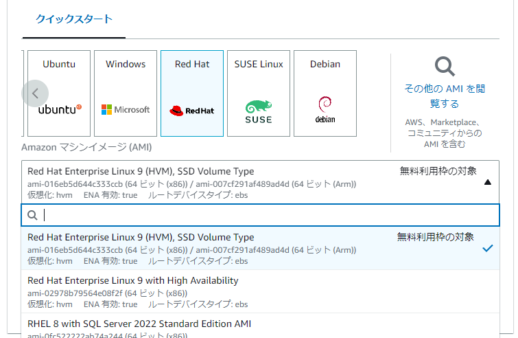

# AWS環境移植作業

毎年やるやつ。残せる内容を残す。

## 2023年度

実施日：2023/04/26

- AWSアカウントを用意し、セキュリティなど各種設定を行う。
- 各種AWSオブジェクトを作成する。リージョンは、今年はus-east-1(バージニア北部)でいく。
  - EC2
    - RHELの無料枠があったので、それを選択。

    - セキュリティグループは後で設定。RDSへの接続が必要なので。念のため、全IPからのSSH接続を許可するがチェック入っていたので外す。
    - 後はほとんどデフォルト。
  - RDS
    - MySQLで作成。設定は適当に。EC2接続設定で、先のEC2を入れておいた。
  - S3
    - バケット名は「charon1212-vcat2-2023」。バックアップファイル保存用のバケットを1つ作成。
    （バケット名はグローバルで一意にしないといけないらしい…）
    - 去年のデータを、ローカルへダウンロードして移送する。
- ローカルにEC2接続用のマクロを用意。後述の[備考_EC2接続マクロ](#備考_ec2接続マクロ)を参照。
- セキュリティグループを設定する。
  - RDS生成時に自動的に2種類のSGが作成されていた。片方はEC2にAttachし、アウトバンドの3306を許可する。もう片方はRDSにAttachし、インバウンドの3306を許可する。
  - EC2のSGにインバウンドの設定を追加。3000port(AP利用)とSSH。SSH側は、teratermアクセスの確認を行う。
- EC2で、以下を実施。
  - [git-clone.sh](../batch/git-clone.sh)を参考に、各種ツールを入れておく。
  - [git-clone.sh](../batch/git-clone.sh)を参考に、git cloneを実行。ディレクトリはHomeディレクトリから1階層掘った。
  - nodeをインストールする。
    - 基本は、AWS公式の<https://docs.aws.amazon.com/ja_jp/sdk-for-javascript/v2/developer-guide/setting-up-node-on-ec2-instance.html>に従う。
      - 【2022年度の記載】node v18をインストールしたら、エラーで使えなかったので、バージョンに注意する。（Amazon Linux 2がサポートしていない旨、上記AWSのドキュメントに記載有り）
    - Redhatのこの辺も参考になる：<https://www.linuxtechi.com/how-to-install-nodejs-on-rhel/>
  - envファイルを更新する。このディレクトリに置いておいた「.env.ec2」をコピーして「.env.ec2.2023」を作成し、EC2へもっていってrename。
  - MySQLへアクセスし、CREATE DATABASEでDBを作成。
  - 下記手順で、サービス開始。
    - 各種サービスのバッチ（「project-home」/batch/*.sh）に764権限を付与。
    - npm install実行
    - ./batch/forever-install.shを実行し、node-foreverを導入。
    - 各種バッチ（./batch/service-main.sh等）を実行
- 前年のRDSからダンプを取得する。
  - `mysqldump <db-name> -u xxx -p -h xxxxx.rds.amazonaws.com > export_vcat2_20230429.sql`
  - GTIDの件のwarningは出なかった。詳細は[備考_MySQLのダンプについて](#備考_mysqlのダンプについて)を参照。
- 前年のEC2からlogディレクトリのバックアップを取得する。
  - `zip -r logs log_2022.zip`

### 補足

- RHEL9で環境を作ったところ認証できず…
  - この辺が理由だった。キーペアを工夫していけた。<https://qiita.com/flets708/items/04d15c37580f4b290be0>

### EC2で実際に打ったコマンド

```bash
# 各種ツールインストール
$ sudo yum update
$ sudo yum install git
$ sudo yum install mysql
# git clone (ディレクトリ移動は適当に実施。念のためこのマニュアルからは削除。)
$ git clone "https://github.com/charon1212/vc-auto-trade-v2.git"
$ cd home
# Node Install
$ curl -o- https://raw.githubusercontent.com/nvm-sh/nvm/v0.39.3/install.sh | bash
$ . ~/.nvm/nvm.sh
$ command -v nvm
$ nvm ls-remote | grep -i latest
$ nvm install --lts
$ node --version
$ npm --version
# DBアクセスし、DB作成
$ mysql -u <username> -h xxxxx.rds.amazonaws.com -p
mysql> CREATE DATABASE <db-name> # .envに指定したDB名に合わせる。
mysql> exit
# ディレクトリ移動後、バッチを実行してAPを始動。
$ chmod 764 batch/*.sh
$ npm install
$ ./batch/forever-install.sh
$ ./batch/service-main.sh
$ ./batch/service-market.sh
$ ./batch/service-express.sh
```

## 備考_MySQLのダンプについて

`sudo yum install mysql`でMySQLを入れていれば、自動的に`mysqldump`もついてくる。以下のコマンドで実行可能。

```bash
mysqldump <db-name> -u <user-name> -p -h xxxxxxx.rds.amazonaws.com --set-gtid-purged=OFF  > test.sql
```

### GTID問題

そのまま`mysqldump`を使うと以下のワーニングが出る。どうやら、GTIDが有効な環境から何も考えずにdumpを取り、GITDが無効な環境やmysqlユーザに十分なOS権限がない状態でインポートしようとするとエラーになるらしい。

```text
Warning: A partial dump from a server that has GTIDs will by default include the GTIDs of all transactions, even those that changed suppressed parts of the database. If you don't want to restore GTIDs, pass --set-gtid-purged=OFF. To make a complete dump, pass --all-databases --triggers --routines --events.
```

参考：

- <https://qiita.com/fumi-m/items/de3d666676cde9ccffdb>
- <https://learn.microsoft.com/ja-jp/azure/mysql/single-server/how-to-troubleshoot-common-errors#error-1227-42000-at-line-18-access-denied-you-need-at-least-one-of-the-super-privileges-for-this-operation>

## 備考_EC2接続マクロ

以下のファイルをttl形式で保存し、teratermで開く。

```ttl
;=====================================================================
; 接続情報
IP = '000.123.456.789'
USERNAME = 'ec2-user'
KEYFILE = 'keyfile.pem'
;=====================================================================
;キーファイル
getdir DIR
makepath KEYPATH DIR KEYFILE
;=====================================================================
;ログディレクトリ
LOGSDIR = DIR
strconcat LOGSDIR '\LOGS\'
foldersearch LOGSDIR
if result = 0 then
foldercreate LOGSDIR
endif
;=====================================================================
; コマンドオプション組立て
COMMAND = IP
strconcat COMMAND ':22 /ssh /2 /auth=publickey'
strconcat COMMAND ' /user='
strconcat COMMAND USERNAME
strconcat COMMAND ' /keyfile='
strconcat COMMAND KEYPATH
;=====================================================================
; 接続
connect COMMAND
;=====================================================================
; ログファイル作成
getdate LogDate '%Y%m%d_%H%M%S'
LogName = LOGSDIR
strconcat LogName IP
strconcat LogName '_'
strconcat LogName LogDate
strconcat LogName '.log'
;=====================================================================
; ログファイル作成
logopen LogName 0 0
;=====================================================================
; 終了
end
```
